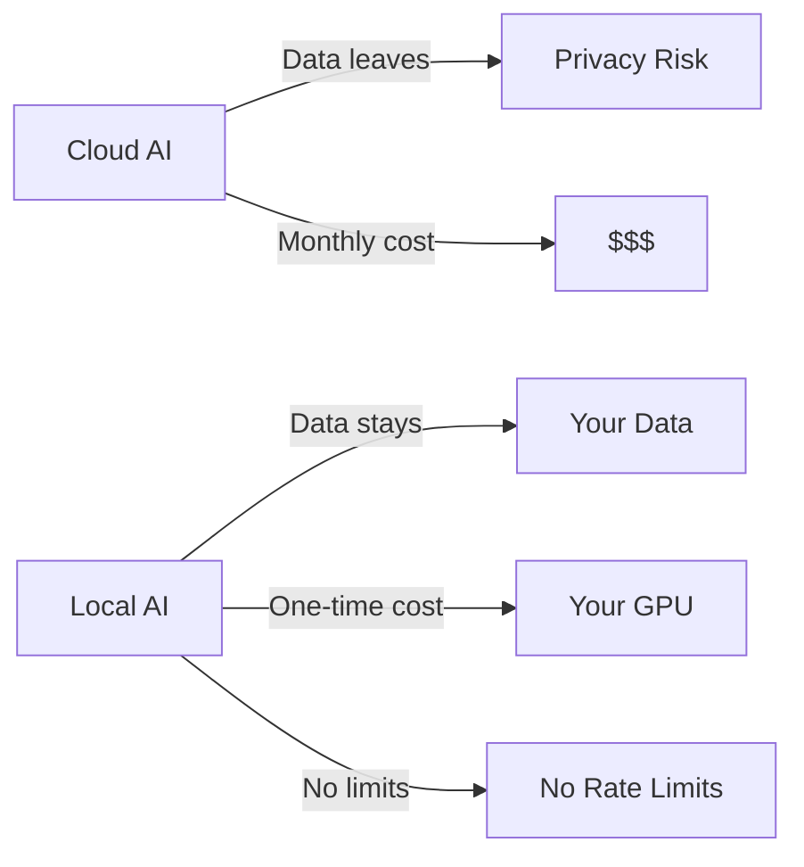

# 📋 Awesome Local AI

**Curated list of tools to run AI 100% locally — LLMs, embeddings, Whisper, vision, agents**

## Why Local?

Run everything on your hardware. No API keys. No data leaks. No monthly bills.

## Categories

- **LLM Inference**: LM Studio, Ollama, llama.cpp, vLLM
- **Embeddings**: nomic-embed, sentence-transformers
- **Speech**: Whisper, Piper TTS, WhisperFlow
- **Vision**: LLaVA, Gemma vision
- **Agents**: Claude Code, JARVIS OS, AutoGPT
- **Orchestration**: n8n, MCP, LangChain
- **Hardware**: GPU clusters, VRAM optimization

## Built with Local AI

[JARVIS OS](https://github.com/Turbo31150/jarvis-linux) runs 600+ agents on 6 GPUs (46GB VRAM) — 100% local.

**Franck Delmas** — [Portfolio](https://turbo31150.github.io/franckdelmas.dev/)
