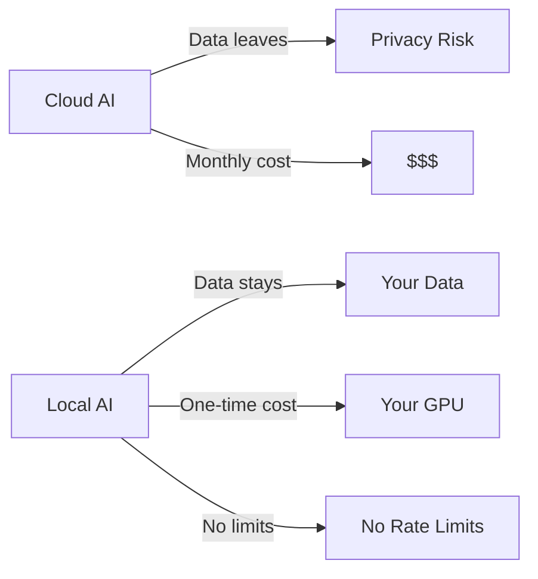

<div align="center">

# 📋 Awesome Local AI

[](https://awesome.re)
[](https://github.com/Turbo31150/awesome-local-ai)

**Curated list of tools to run AI 100% locally — LLMs, embeddings, Whisper, vision, agents**

</div>

## Why Local?



Run everything on your hardware. No API keys. No data leaks. No monthly bills.

## Categories

- **LLM Inference**: LM Studio, Ollama, llama.cpp, vLLM
- **Embeddings**: nomic-embed, sentence-transformers
- **Speech**: Whisper, Piper TTS, WhisperFlow
- **Vision**: LLaVA, Gemma vision
- **Agents**: Claude Code, JARVIS OS, AutoGPT
- **Orchestration**: n8n, MCP, LangChain
- **Hardware**: GPU clusters, VRAM optimization

## Built with Local AI

[JARVIS OS](https://github.com/Turbo31150/jarvis-linux) runs 600+ agents on 6 GPUs (46GB VRAM) — 100% local.

**Franck Delmas** — [Portfolio](https://turbo31150.github.io/franckdelmas.dev/)


---


## Getting Started with Local AI

### Step 1: Choose Your Inference Engine

| Engine | Best For | GPU Required |
|--------|----------|-------------|
| **LM Studio** | Beginners, GUI | 8GB+ VRAM |
| **Ollama** | CLI, quick testing | 4GB+ VRAM |
| **vLLM** | Production, high throughput | 16GB+ VRAM |
| **llama.cpp** | CPU inference, low resources | No GPU needed |

### Step 2: Pick Your Models

```bash
# Chat/reasoning
ollama pull llama3.1:8b          # General purpose
ollama pull deepseek-r1:7b       # Deep reasoning
ollama pull qwen2.5:7b           # Multilingual

# Voice
# Install Whisper for speech-to-text
pip install openai-whisper

# Embeddings  
ollama pull nomic-embed-text     # Document search
```

### Step 3: Build Your Pipeline

```python
# Simple local AI pipeline
import requests

# Query your local model
response = requests.post("http://localhost:11434/api/generate", json={
    "model": "llama3.1:8b",
    "prompt": "Explain quantum computing in 3 sentences"
})
print(response.json()["response"])
# → Runs entirely on YOUR hardware. Zero API costs.
```

## Cost Comparison: Cloud vs Local

| | Cloud (GPT-4) | Local (8B model) | Local (JARVIS Cluster) |
|---|---|---|---|
| **Monthly cost** | $200-2000 | $5 electricity | $30 electricity |
| **Setup cost** | $0 | $500-1000 GPU | $3000 cluster |
| **Privacy** | Data sent to OpenAI | 100% local | 100% local |
| **Speed** | 500ms+ (network) | 50-200ms | 1-5ms (cached) |
| **Rate limits** | Yes (TPM/RPM) | None | None |
| **Offline** | No | Yes | Yes |
| **Break-even** | - | 3 months | 6 months |

## Real-World Local AI Projects

All built with 100% local inference:

| Project | What It Does |
|---------|-------------|
| [JARVIS OS](https://github.com/Turbo31150/jarvis-linux) | 600+ agents on 6 GPUs |
| [WhisperFlow](https://github.com/Turbo31150/jarvis-whisper-flow) | Voice AI <300ms |
| [TradeOracle](https://github.com/Turbo31150/TradeOracle) | AI trading consensus |
| [LUMEN](https://github.com/Turbo31150/lumen) | 50+ language transcription |


---

## Why Run AI Locally?

### 1. Cost: Save $200+/month

Cloud API calls add up fast. Running GPT-4-class queries at scale costs **$0.03-0.06 per 1K tokens**. A typical development workflow with 500+ daily queries costs **$200-400/month**. With local inference on consumer GPUs, the marginal cost per query is **$0.00** -- you only pay electricity (~$30/month for a multi-GPU rig running 24/7).

### 2. Privacy: GDPR Compliant by Default

When you run AI locally, **your data never leaves your network**. No prompts sent to external servers, no training on your proprietary code, no compliance paperwork. For companies handling sensitive data (medical, financial, legal), local AI means **GDPR/HIPAA compliance by architecture**, not by contract.

### 3. Speed: No Network Latency

Cloud API calls have **100-500ms of network overhead** before the model even starts generating. Local inference on a good GPU starts generating in **< 50ms**. For real-time applications (autocomplete, voice assistants, coding agents), this difference is the gap between feeling instant and feeling sluggish. The JARVIS cluster achieves **0.4s full response time** with gemma-3-4b -- faster than most cloud API round-trips.


---

## Detailed Model Comparison

### Chat/Reasoning Models

| Model | Size | VRAM Required | Speed (tok/s) | Quality | Best For |
|-------|------|---------------|---------------|---------|----------|
| **Llama 3.1 8B** | 4.7 GB (Q4) | 6 GB | 40-80 | Good | General chat, coding |
| **Llama 3.1 70B** | 40 GB (Q4) | 48 GB | 8-15 | Excellent | Complex reasoning |
| **Gemma 3 4B** | 2.5 GB (Q4) | 4 GB | 80-120 | Good | Fast responses, agents |
| **Qwen 2.5 7B** | 4.4 GB (Q4) | 6 GB | 35-70 | Very Good | Multilingual, coding |
| **Qwen 2.5 72B** | 41 GB (Q4) | 48 GB | 6-12 | Excellent | Best open multilingual |
| **DeepSeek R1 7B** | 4.5 GB (Q4) | 6 GB | 30-60 | Very Good | Deep reasoning, math |
| **DeepSeek R1 70B** | 40 GB (Q4) | 48 GB | 5-10 | Excellent | Research-grade reasoning |
| **Mistral 7B** | 4.1 GB (Q4) | 6 GB | 45-90 | Good | Fast, European languages |
| **Phi-3 Mini 3.8B** | 2.2 GB (Q4) | 4 GB | 60-100 | Good | Edge devices, mobile |
| **CodeLlama 34B** | 19 GB (Q4) | 24 GB | 12-25 | Excellent | Code generation |

### Quantization Impact

| Quantization | Size Reduction | Quality Loss | Recommended When |
|-------------|---------------|-------------|-----------------|
| **FP16** | 0% (baseline) | None | Unlimited VRAM |
| **Q8_0** | 50% | Minimal (<1%) | 24GB+ VRAM |
| **Q6_K** | 62% | Very small (1-2%) | 16GB+ VRAM |
| **Q5_K_M** | 68% | Small (2-3%) | 12GB+ VRAM |
| **Q4_K_M** | 75% | Moderate (3-5%) | 8GB+ VRAM (sweet spot) |
| **Q3_K_M** | 81% | Noticeable (5-8%) | 6GB VRAM |
| **Q2_K** | 87% | Significant (10-15%) | CPU only, testing |

> **Rule of thumb**: Q4_K_M is the sweet spot for most users. It preserves 95-97% of model quality at 25% of the original size.

### VRAM Calculator

```
Required VRAM = Model Size (GB) + Context Window Overhead

Context overhead (approximate):
  2K context:  +0.5 GB
  4K context:  +1.0 GB
  8K context:  +2.0 GB
  16K context: +4.0 GB
  32K context: +8.0 GB

Example: Llama 3.1 8B Q4 with 8K context
  = 4.7 GB (model) + 2.0 GB (context) = 6.7 GB VRAM needed
```

---

## Embedding Models Guide

Embeddings convert text into vectors for semantic search, RAG, and clustering.

### Model Comparison

| Model | Dimensions | Size | Speed | Quality (MTEB) | Best For |
|-------|-----------|------|-------|----------------|----------|
| **nomic-embed-text** | 768 | 274 MB | Fast | 62.4 | General purpose, Ollama native |
| **mxbai-embed-large** | 1024 | 670 MB | Medium | 64.7 | Higher quality search |
| **all-MiniLM-L6-v2** | 384 | 80 MB | Very Fast | 56.3 | Resource-constrained |
| **bge-large-en-v1.5** | 1024 | 1.3 GB | Slow | 64.2 | English-focused |
| **multilingual-e5-large** | 1024 | 2.2 GB | Slow | 61.5 | 100+ languages |
| **gte-large-en-v1.5** | 1024 | 1.3 GB | Medium | 65.4 | Best open English |

### Quick Start with Embeddings

```python
import requests
import numpy as np

# Generate embeddings with Ollama
def embed(text: str) -> list[float]:
    response = requests.post("http://localhost:11434/api/embeddings", json={
        "model": "nomic-embed-text",
        "prompt": text
    })
    return response.json()["embedding"]

# Semantic similarity
def cosine_similarity(a: list[float], b: list[float]) -> float:
    a, b = np.array(a), np.array(b)
    return np.dot(a, b) / (np.linalg.norm(a) * np.linalg.norm(b))

# Example
v1 = embed("How to deploy a Docker container")
v2 = embed("Container deployment with Docker")
v3 = embed("Best pizza recipe in Naples")

print(cosine_similarity(v1, v2))  # ~0.92 (very similar)
print(cosine_similarity(v1, v3))  # ~0.15 (unrelated)
```

---

## RAG Pipeline Tutorial

Retrieval-Augmented Generation (RAG) lets your local LLM answer questions from your own documents.

### Architecture

```
Documents --> Chunking --> Embedding --> Vector Store
                                            |
User Query --> Embedding ----> Similarity Search
                                            |
                                    Top-K Chunks
                                            |
                              LLM + Context --> Answer
```

### Step-by-Step Implementation

```python
# rag_pipeline.py -- Complete local RAG in 60 lines
import requests
import numpy as np
from pathlib import Path

OLLAMA = "http://localhost:11434"

# Step 1: Chunk your documents
def chunk_text(text: str, chunk_size: int = 500, overlap: int = 50) -> list[str]:
    words = text.split()
    chunks = []
    for i in range(0, len(words), chunk_size - overlap):
        chunk = " ".join(words[i:i + chunk_size])
        if chunk:
            chunks.append(chunk)
    return chunks

# Step 2: Generate embeddings
def embed(text: str) -> list[float]:
    r = requests.post(f"{OLLAMA}/api/embeddings",
                      json={"model": "nomic-embed-text", "prompt": text})
    return r.json()["embedding"]

# Step 3: Build vector store (simple in-memory)
class VectorStore:
    def __init__(self):
        self.vectors = []
        self.texts = []
    
    def add(self, text: str, vector: list[float]):
        self.vectors.append(np.array(vector))
        self.texts.append(text)
    
    def search(self, query_vector: list[float], top_k: int = 3) -> list[str]:
        q = np.array(query_vector)
        scores = [np.dot(q, v) / (np.linalg.norm(q) * np.linalg.norm(v))
                  for v in self.vectors]
        top_indices = np.argsort(scores)[-top_k:][::-1]
        return [self.texts[i] for i in top_indices]

# Step 4: Index your documents
store = VectorStore()
for file in Path("docs/").glob("*.txt"):
    text = file.read_text()
    for chunk in chunk_text(text):
        vector = embed(chunk)
        store.add(chunk, vector)

# Step 5: Query with RAG
def ask(question: str) -> str:
    query_vector = embed(question)
    context_chunks = store.search(query_vector, top_k=3)
    context = "\n\n".join(context_chunks)
    
    prompt = f"""Based on the following context, answer the question.
    
Context:
{context}

Question: {question}

Answer:"""
    
    r = requests.post(f"{OLLAMA}/api/generate",
                      json={"model": "llama3.1:8b", "prompt": prompt, "stream": False})
    return r.json()["response"]

# Usage
answer = ask("How does JARVIS handle GPU failover?")
print(answer)  # Answers using YOUR documents, not training data
```

---

## Fine-Tuning Local Models

### When to Fine-Tune

| Approach | When to Use | Effort | Quality |
|----------|------------|--------|---------|
| **Prompt engineering** | First try always | Low | Good |
| **RAG** | Need factual answers from your data | Medium | Very Good |
| **Fine-tuning** | Need specific style/format/domain | High | Excellent |
| **Full training** | Building a new capability | Very High | Best |

### Fine-Tuning with Unsloth (Fastest Method)

```bash
# Install Unsloth (2x faster than standard fine-tuning)
pip install unsloth

# Prepare training data (JSONL format)
# data/train.jsonl:
# {"instruction": "Analyze this trade signal", "input": "BTC breakout above 65000", "output": "BULLISH signal..."}
# {"instruction": "Calculate risk score", "input": "Portfolio: 60% BTC, 40% ETH", "output": "Risk: 72/100..."}
```

```python
from unsloth import FastLanguageModel

# Load base model with 4-bit quantization
model, tokenizer = FastLanguageModel.from_pretrained(
    model_name="unsloth/llama-3.1-8b-bnb-4bit",
    max_seq_length=2048,
    load_in_4bit=True,
)

# Add LoRA adapters (only trains ~1% of parameters)
model = FastLanguageModel.get_peft_model(
    model,
    r=16,              # LoRA rank
    lora_alpha=16,     # Scaling factor
    target_modules=["q_proj", "k_proj", "v_proj", "o_proj"],
    lora_dropout=0,
)

# Train
from trl import SFTTrainer
trainer = SFTTrainer(
    model=model,
    train_dataset=dataset,
    max_seq_length=2048,
    per_device_train_batch_size=2,
    num_train_epochs=3,
)
trainer.train()

# Export to GGUF for Ollama/LM Studio
model.save_pretrained_gguf("my-model", tokenizer, quantization_method="q4_k_m")
# --> my-model-Q4_K_M.gguf (ready for local inference)
```

---

## Troubleshooting GPU Issues

### Common Problems and Solutions

#### Out of Memory (OOM)

```
CUDA out of memory. Tried to allocate 2.00 GiB
```

**Solutions (in order)**:
1. Use a smaller quantization: Q4_K_M instead of Q8
2. Reduce context window: `--ctx-size 2048` instead of 8192
3. Use `--n-gpu-layers` to offload some layers to CPU
4. Close other GPU applications (check `nvidia-smi`)
5. Use a smaller model

#### Slow Generation

| Symptom | Cause | Fix |
|---------|-------|-----|
| < 5 tok/s | Model too large for GPU | Use smaller quant or model |
| Starts fast, slows down | Context window filling up | Reduce max context |
| Inconsistent speed | Thermal throttling | Check GPU temperature |
| CPU inference (very slow) | Model not loaded on GPU | Check `--n-gpu-layers` flag |

#### GPU Not Detected

```bash
# Check if NVIDIA driver is loaded
nvidia-smi

# Check CUDA version
nvcc --version

# For Ollama: check GPU detection
ollama run llama3.1:8b --verbose 2>&1 | grep -i gpu

# For LM Studio: Settings > GPU > Enable GPU acceleration
```

#### Multi-GPU Setup

```bash
# LM Studio: automatically uses all GPUs
# Ollama: set CUDA_VISIBLE_DEVICES
CUDA_VISIBLE_DEVICES=0,1 ollama serve

# llama.cpp: split layers across GPUs
./main -m model.gguf --n-gpu-layers 99 --tensor-split 0.5,0.5

# vLLM: tensor parallelism
python -m vllm.entrypoints.openai.api_server \
    --model meta-llama/Llama-3.1-70B \
    --tensor-parallel-size 2
```

---

## Community Resources

### Discord Servers

| Server | Focus | Members |
|--------|-------|---------|
| [LocalLLaMA](https://discord.gg/localllama) | General local AI | 50K+ |
| [Ollama](https://discord.gg/ollama) | Ollama users | 30K+ |
| [LM Studio](https://discord.gg/lmstudio) | LM Studio users | 20K+ |
| [llama.cpp](https://discord.gg/llama-cpp) | Low-level inference | 15K+ |
| [Unsloth](https://discord.gg/unsloth) | Fine-tuning | 10K+ |

### Subreddits

- [r/LocalLLaMA](https://reddit.com/r/LocalLLaMA) -- The main hub for local AI discussion
- [r/ollama](https://reddit.com/r/ollama) -- Ollama-specific tips and models
- [r/MachineLearning](https://reddit.com/r/MachineLearning) -- Research papers and breakthroughs
- [r/selfhosted](https://reddit.com/r/selfhosted) -- Self-hosted AI services

### Benchmarks and Leaderboards

- [Open LLM Leaderboard](https://huggingface.co/spaces/HuggingFaceH4/open_llm_leaderboard) -- Model quality comparison
- [LLM Perf Leaderboard](https://huggingface.co/spaces/optimum/llm-perf-leaderboard) -- Speed benchmarks
- [MTEB Leaderboard](https://huggingface.co/spaces/mteb/leaderboard) -- Embedding model comparison
- [Chatbot Arena](https://chat.lmsys.org/) -- Human preference rankings

### Essential Reading

- [The Illustrated Transformer](https://jalammar.github.io/illustrated-transformer/) -- How LLMs work
- [GGUF Format Spec](https://github.com/ggerganov/ggml/blob/master/docs/gguf.md) -- Understanding model files
- [LoRA Paper](https://arxiv.org/abs/2106.09685) -- How fine-tuning adapters work
- [RAG Survey](https://arxiv.org/abs/2312.10997) -- Comprehensive RAG overview


## License

MIT License — Free for personal and commercial use.

## Author

**Franck Delmas** — AI Systems Architect
- [GitHub](https://github.com/Turbo31150) · [Portfolio](https://turbo31150.github.io/franckdelmas.dev/) · [LinkedIn](https://linkedin.com/in/franck-hlb-80bb231b1) · [Codeur](https://codeur.com/-6666zlkh)

Part of [JARVIS OS](https://github.com/Turbo31150/jarvis-linux) ecosystem.
