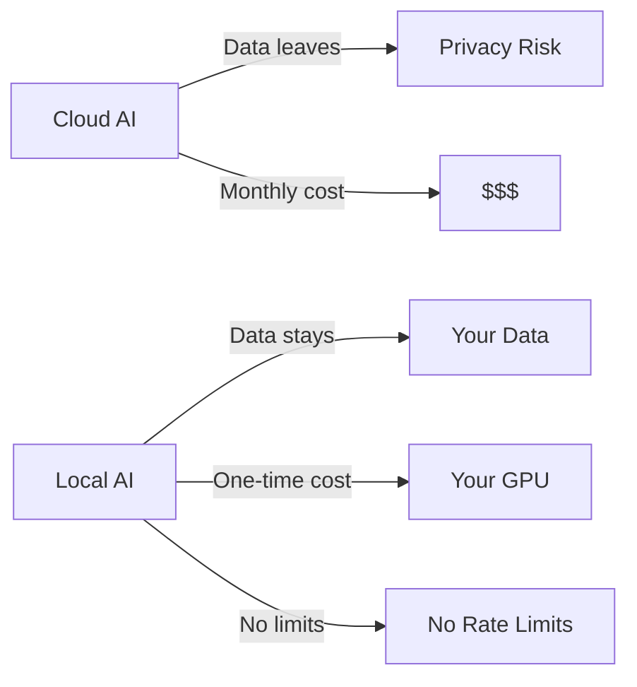

<div align="center">

# 📋 Awesome Local AI

[](https://awesome.re)
[](https://github.com/Turbo31150/awesome-local-ai)

**Curated list of tools to run AI 100% locally — LLMs, embeddings, Whisper, vision, agents**

</div>

## Why Local?



Run everything on your hardware. No API keys. No data leaks. No monthly bills.

## Categories

- **LLM Inference**: LM Studio, Ollama, llama.cpp, vLLM
- **Embeddings**: nomic-embed, sentence-transformers
- **Speech**: Whisper, Piper TTS, WhisperFlow
- **Vision**: LLaVA, Gemma vision
- **Agents**: Claude Code, JARVIS OS, AutoGPT
- **Orchestration**: n8n, MCP, LangChain
- **Hardware**: GPU clusters, VRAM optimization

## Built with Local AI

[JARVIS OS](https://github.com/Turbo31150/jarvis-linux) runs 600+ agents on 6 GPUs (46GB VRAM) — 100% local.

**Franck Delmas** — [Portfolio](https://turbo31150.github.io/franckdelmas.dev/)


---


## Getting Started with Local AI

### Step 1: Choose Your Inference Engine

| Engine | Best For | GPU Required |
|--------|----------|-------------|
| **LM Studio** | Beginners, GUI | 8GB+ VRAM |
| **Ollama** | CLI, quick testing | 4GB+ VRAM |
| **vLLM** | Production, high throughput | 16GB+ VRAM |
| **llama.cpp** | CPU inference, low resources | No GPU needed |

### Step 2: Pick Your Models

```bash
# Chat/reasoning
ollama pull llama3.1:8b          # General purpose
ollama pull deepseek-r1:7b       # Deep reasoning
ollama pull qwen2.5:7b           # Multilingual

# Voice
# Install Whisper for speech-to-text
pip install openai-whisper

# Embeddings  
ollama pull nomic-embed-text     # Document search
```

### Step 3: Build Your Pipeline

```python
# Simple local AI pipeline
import requests

# Query your local model
response = requests.post("http://localhost:11434/api/generate", json={
    "model": "llama3.1:8b",
    "prompt": "Explain quantum computing in 3 sentences"
})
print(response.json()["response"])
# → Runs entirely on YOUR hardware. Zero API costs.
```

## Cost Comparison: Cloud vs Local

| | Cloud (GPT-4) | Local (8B model) | Local (JARVIS Cluster) |
|---|---|---|---|
| **Monthly cost** | $200-2000 | $5 electricity | $30 electricity |
| **Setup cost** | $0 | $500-1000 GPU | $3000 cluster |
| **Privacy** | Data sent to OpenAI | 100% local | 100% local |
| **Speed** | 500ms+ (network) | 50-200ms | 1-5ms (cached) |
| **Rate limits** | Yes (TPM/RPM) | None | None |
| **Offline** | No | Yes | Yes |
| **Break-even** | - | 3 months | 6 months |

## Real-World Local AI Projects

All built with 100% local inference:

| Project | What It Does |
|---------|-------------|
| [JARVIS OS](https://github.com/Turbo31150/jarvis-linux) | 600+ agents on 6 GPUs |
| [WhisperFlow](https://github.com/Turbo31150/jarvis-whisper-flow) | Voice AI <300ms |
| [TradeOracle](https://github.com/Turbo31150/TradeOracle) | AI trading consensus |
| [LUMEN](https://github.com/Turbo31150/lumen) | 50+ language transcription |


---

## Why Run AI Locally?

### 1. Cost: Save $200+/month

Cloud API calls add up fast. Running GPT-4-class queries at scale costs **$0.03-0.06 per 1K tokens**. A typical development workflow with 500+ daily queries costs **$200-400/month**. With local inference on consumer GPUs, the marginal cost per query is **$0.00** -- you only pay electricity (~$30/month for a multi-GPU rig running 24/7).

### 2. Privacy: GDPR Compliant by Default

When you run AI locally, **your data never leaves your network**. No prompts sent to external servers, no training on your proprietary code, no compliance paperwork. For companies handling sensitive data (medical, financial, legal), local AI means **GDPR/HIPAA compliance by architecture**, not by contract.

### 3. Speed: No Network Latency

Cloud API calls have **100-500ms of network overhead** before the model even starts generating. Local inference on a good GPU starts generating in **< 50ms**. For real-time applications (autocomplete, voice assistants, coding agents), this difference is the gap between feeling instant and feeling sluggish. The JARVIS cluster achieves **0.4s full response time** with gemma-3-4b -- faster than most cloud API round-trips.

## License

MIT License — Free for personal and commercial use.

## Author

**Franck Delmas** — AI Systems Architect
- [GitHub](https://github.com/Turbo31150) · [Portfolio](https://turbo31150.github.io/franckdelmas.dev/) · [LinkedIn](https://linkedin.com/in/franck-hlb-80bb231b1) · [Codeur](https://codeur.com/-6666zlkh)

Part of [JARVIS OS](https://github.com/Turbo31150/jarvis-linux) ecosystem.
